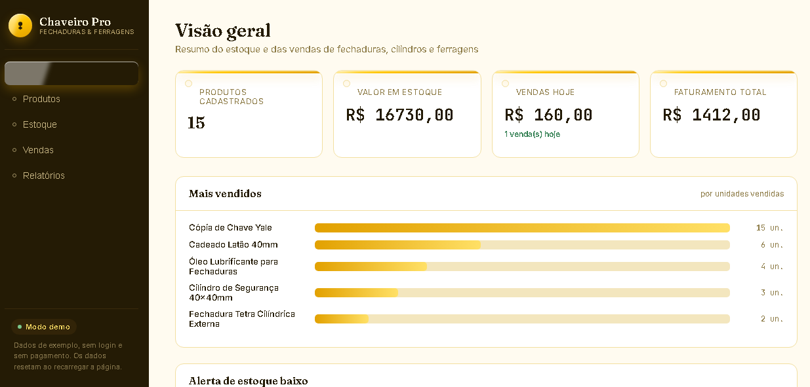

# 🔧 Chaveiro Pro — Painel de Gestão (Demo)

Painel web de **gestão de produtos, estoque e vendas** para chaveiros e serralherias — controle de fechaduras, cilindros e ferragens. Versão demonstrativa (front-end puro, sem backend), que deu origem à versão SaaS completa.

🔗 **Demo ao vivo:** https://cheveiro-gestao.vercel.app

> 💡 Existe também a versão **SaaS completa** deste sistema, com login, multi-cliente e cobrança via Stripe: [chaveiro-saas](https://github.com/jcavalcante88/chaveiro-saas).



---

## ✨ Funcionalidades

- 📊 **Visão geral:** resumo de estoque e vendas em um dashboard
- 📦 **Produtos:** cadastro com categoria, SKU, custo, preço de venda e **cálculo de margem**
- 🔎 **Busca e filtros** por nome, SKU e categoria
- 📉 **Alerta de estoque baixo**
- 🛒 **Controle de estoque** com entradas e saídas
- 💾 Dados persistidos localmente no navegador (localStorage)

## 🛠️ Tecnologias

- **HTML5, CSS3 e JavaScript puro** (sem frameworks)
- Interface responsiva com design _glassmorphism_
- Deploy na **Vercel**

## 🚀 Como rodar

Por ser um site estático, basta abrir o arquivo:

```bash
git clone https://github.com/jcavalcante88/cheveiro-gestao.git
cd cheveiro-gestao
# abra o index.html no navegador (ou use a extensão Live Server do VS Code)
```

## 🧠 O que este projeto demonstra

Domínio de **JavaScript puro** para construir uma aplicação completa de página única (SPA) — manipulação de DOM, estado, filtros, cálculos de negócio (margem, capital em estoque) e persistência local — tudo sem depender de frameworks.

---

## 👤 Autor

**Jerry Cavalcante Camargo Das Dores** — Desenvolvedor Full-Stack

- 🐙 GitHub: [@jcavalcante88](https://github.com/jcavalcante88)
- 💼 LinkedIn: [jerry-camargo](https://www.linkedin.com/in/jerry-camargo)
- 🌐 Portfólio: [portf-lio-xi-ruddy.vercel.app](https://portf-lio-xi-ruddy.vercel.app)
